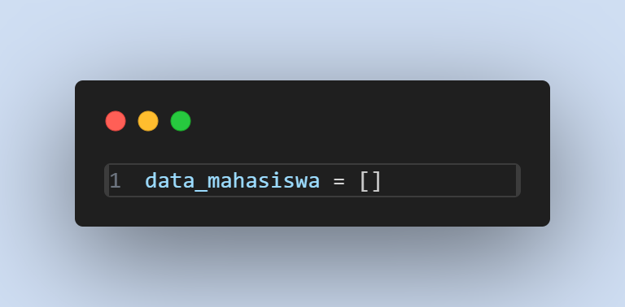
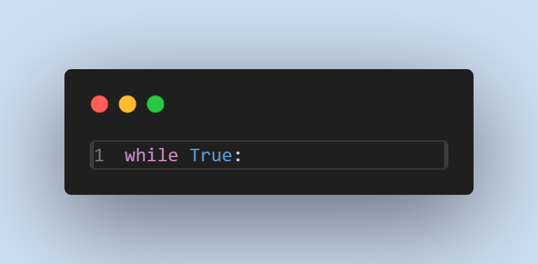
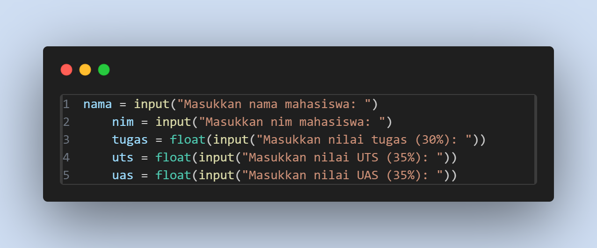
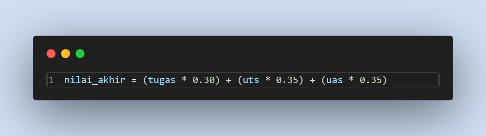
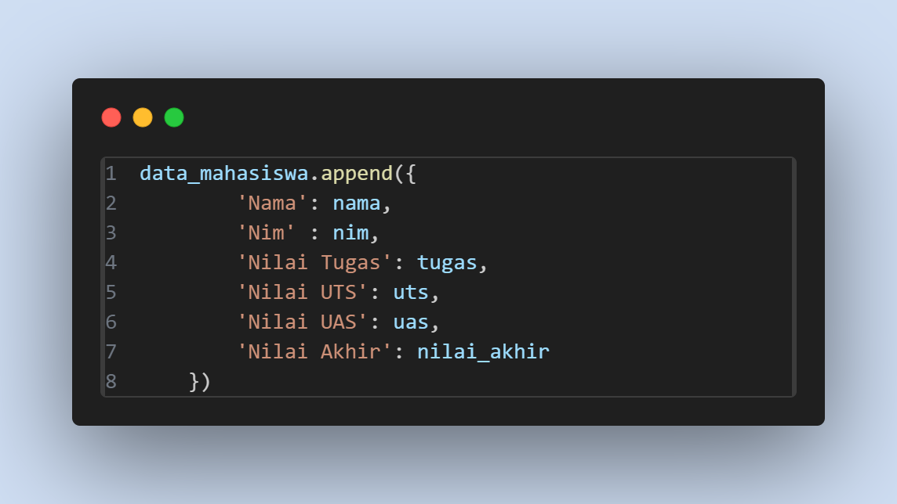
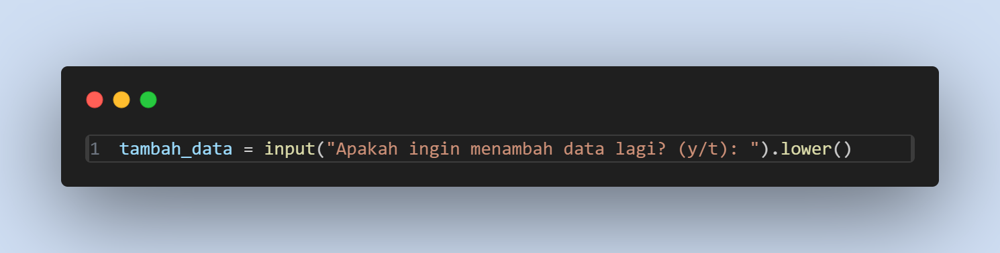
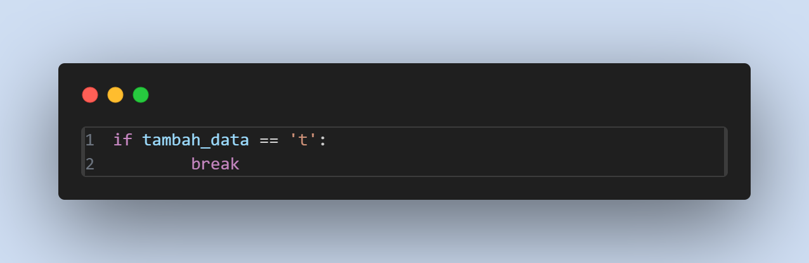
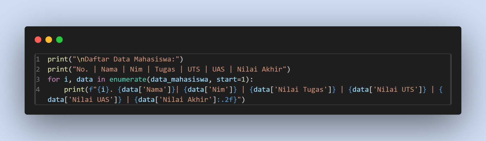

# praktikum4
## 1. Iniliasasi list untuk menyimpan data

-data_mahasiswa: Merupakan nilai kosong yang digunakan untuk menyimpan data dari setiap mahasiswa. Setiap kali pengguna memasukkan data, informasi akan ditambahkan ke dalam list ini.

## 2. Memulai perulangan

-while_True: Ini adalah perulangan tak terbatas yang akan terus berjalan sampai kita secara eksplisit menghentikannya. Pada kasus ini, kita akan keluar dari loop ketika pengguna memasukkan t(tidak) saat ditanya apakah ingin menambahkan data.

## 3. Meminta input dari Pengguna

-nama = input(): Meminta pengguna memasukkan nama Mahasiswa. Nilai yang dimasukkan akan disimpan dalam variabel nama.
-tugas = float(input()), uts = float(input()), uas = float(input()): Meminta pengguna memasukkan nilai tugas , UTS, dan UAS masing-masing. Nilai tersebut dikonversi menjadi tipe data float(bilangan desimal) untuk keperluan perhitungan.

## 4. Menghitung Nilai Akhir Berdasarkan Bobot

-nilai_akhir: Menghitung nilai akhir berdasarkan persentase nilai tugas, UTS, dan UAS yang masing-masing memiliki bobot 30%,35%,dan 35%. Perhitungan ini dilakukan dengan mengalikan nilai tugas, UTS, UAS dengan bobotnya masing-masing dan menjumlahkan

## 5. Menyimpan data ke dalam list

-data_mahasiswa.append(): Menambahkan sebuah dictionary kedalam list
data_mahasiswa . Dictionary ini menyimpan nama mahasiswa dan nilai yang mereka masukkan, termasuk nilai akhir yang dihitung.
    -'Nama': nama: Menyimpan nama mahasiswa
    -'Nim': nim: Menyimpan nim mahasiswa
    -'Nilai tugas','Nilai UTS','Nilai UAS': Menyimpan nilai tugas,UTS dan UAS yang dimasukkan.
    -'Nilai akhir': Menyimpan hasil perhitungan nilai akhir

## 6. Menanyakan apakah pengguna ingin menambahkan data lagi

-tambah_data: Menyimpan input pengguna apakah ingin menambah data lagi. input() digunakan untuk meminta jawaban, dan .lower() memastikan bahwa input diubah menjadi huruf kecil agar tidak sensitif terhadap huruf besar/kecil.

-if tambah_data == 't': break: Jika pengguna menjawab t (tidak), maka perulangan berhenti dengan perintah break. Jika jawaban adalah selain t, perulangan akan terus berlanjut.

## 7. Menampilkan data yang telah diminta

-print(): Digunakan untuk mencetak atau menampilkan informasi ke layar. Bagian ini menampilkan judul serta kolom-kolom seperti "Nama","Nim", "Tugas", "UTS", "UAS", dan "Nilai Akhir".
-enumerate(data_mahasiswa, start=1): Fungsi enumerate() digunakan untuk memberikan nomor urut pada setiap data mahasiswa yang ada di list data_mahasiswa. Parameter start=1 memastikan penomoran dimulai dari 1.
-f"{i}. {data['Nama']} | {data['Nilai Tugas']} | ...": Format string yang digunakan untuk menampilkan data mahasiswa dengan format yang rapi. :.2f digunakan untuk membatasi dua angka desimal pada nilai akhir.